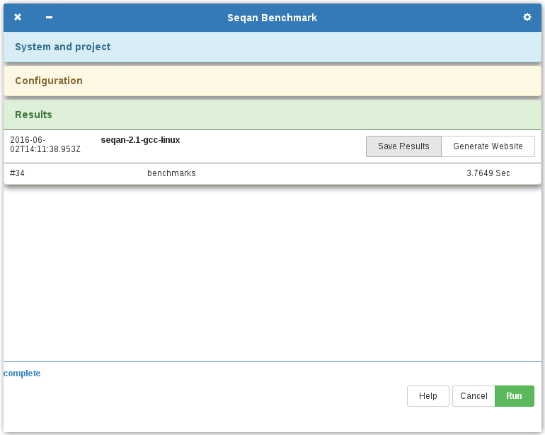

Seqan Bench App
===============

Introduction
------------

This application provides a graphical user interface for benchmarks of
biological problems. The benchmarks are pre-implemented by using the SeqAn
library, but can be exchanged to test the performance of other libraries.

Download
--------

Executables for Linux, OS X and Windows are available
[Here](https://github.com/marehr/bench/releases).

Usage
-----

Unpack (howto on
[Windows](https://wiki.haskell.org/How_to_unpack_a_tar_file_in_Windows)) the
downloaded file and execute `seqan-bench-app[.exe]`. The application will
automatically download the needed data and preprocess it.

Press run to start the benchmarks.


As you can see, the app shows the current OS, Memory, CPU frequency (can be used
as an indicator if the CPU frequency was correctly fixed), the number of threads
and a project title.

The project title is intended to give the measured benchmark-results a
recognizable name. In this example the title is `seqan-2.1-gcc-linux`,
indicating that the benchmark was run on Linux using the SeqAn library 2.1 and
GCC compiler.


✔ complete: means that the benchmark executed without error

✔ output: means that the output of the benchmark was as specified. This check
will be done by a validator (see below if you want to know how this works).



After the benchmark was executed, there is a summary how much time it took and
save buttons to save the results into a json file or to generate a website.
Clicking on `seqan-2.1-gcc-linux` in the summary will expand the results again.


This is an example how a generated website looks like. It will give you a score.
1000 means same performance as our test system. Less than 1000 means your
benchmark/system was slower than our test system, more than 1000 means that your
benchmark/system was faster. A score of 2000, 3000, ... means that your
benchmark/system is 2, 3, ... times fast than our test system.

Our current test system uses a `Intel(R) Xeon(R) CPU E5-2650 v3 @ 2.30GHz` CPU
fixed by [cpufrequtils](http://www.thinkwiki.org/wiki/How_to_use_cpufrequtils)
at 2.3 GHz. We might change the base frequency to 1.9 GHz in the future, because
that is the base frequency of AVX2 on this CPU.

Benchmarks
----------

Currently, we define the following benchmarks:

-   indices
    -   [exact search](
        https://github.com/marehr/bench/wiki/index_exact_search)
    -   [approximate search, 1 error with hamming distance](
        https://github.com/marehr/bench/wiki/index_one_error_approximate_search)
    -   [approximate search, 2 error with hamming distance](
        https://github.com/marehr/bench/wiki/index_three_errors_approximate_search)
    -   [approximate search, 3 error with hamming distance](
        https://github.com/marehr/bench/wiki/index_two_errors_approximate_search)
-   k-mers
    -   [counting 10-mers](
        https://github.com/marehr/bench/wiki/kmers_10mer_counting)
    -   [counting 15-mers](
        https://github.com/marehr/bench/wiki/kmers_15mer_counting)
    -   [counting 50-mers](
        https://github.com/marehr/bench/wiki/kmers_50mer_counting)
-   pairwise alignments
    -   [global alignment, linear gap model on DNA alphabet](
        https://github.com/marehr/bench/wiki/pairwise_alignment_global_affine_dna)
    -   [global alignment, linear gap model on amino acid alphabet](
        https://github.com/marehr/bench/wiki/pairwise_alignment_global_affine_protein)
    -   [global alignment, affine gap model on DNA alphabet](
        https://github.com/marehr/bench/wiki/pairwise_alignment_global_linear_dna)
    -   [global alignment, affine gap model on amino acid alphabet](
        https://github.com/marehr/bench/wiki/pairwise_alignment_global_linear_protein)
    -   [local alignment, linear gap model on DNA alphabet](
        https://github.com/marehr/bench/wiki/pairwise_alignment_local_affine_dna)
    -   [local alignment, linear gap model on amino acid alphabet](
        https://github.com/marehr/bench/wiki/pairwise_alignment_local_affine_protein)
    -   [local alignment, affine gap model on DNA alphabet](
        https://github.com/marehr/bench/wiki/pairwise_alignment_local_linear_dna)
    -   [local alignment, affine gap model on amino acid alphabet](
        https://github.com/marehr/bench/wiki/pairwise_alignment_local_linear_protein)

Building from source
--------------------

### Requirements

-   [cmake](https://cmake.org) (≥ 3.0),
-   [Node.js](https://nodejs.org/) (≥ 14.5),
    -   `npm install` in the source directory will install all required
        `node_modules`.
-   [python](https://nodejs.org/) (both python ≥ 2.7 and python ≥ 3.4 work),
    -   For windows packaging `pip install py2exe` is needed
    -   Note: At the time of writing this readme, py2exe required python 3.4 to
        work.
-   [NW.js](http://nwjs.io/) (≥ 14.5) and
-   the [SeqAn](https://github.com/seqan/seqan) (≥ 2.0) library.

### Prepare build

(On windows you could use this terminal emulator
<https://git-for-windows.github.io/>)

Download source code

``` terminal
git clone -b bench_app https://github.com/marehr/bench.git
cd bench/bench_app
```

Download seqan source code

``` terminal
git clone https://github.com/seqan/seqan.git
```

Install needed node modules

``` terminal
npm install
```

Install NW.js

``` terminal
wget http://dl.nwjs.io/v0.14.5/nwjs-sdk-v0.14.5-linux-x64.tar.gz
tar xfvz nwjs-sdk-v0.14.5-linux-x64.tar.gz
```

### Build benchmarks

``` terminal
# in bench/bench_app
cd benchmarks

cmake ../benchmarks_src \
    -DCMAKE_MODULE_PATH=../seqan/util/cmake/ \
    -DCMAKE_INCLUDE_PATH=../seqan/include/ \
    -DCMAKE_RUNTIME_OUTPUT_DIRECTORY=. \
    -DCMAKE_RUNTIME_OUTPUT_DIRECTORY_RELEASE=.

cmake --build . --config Release

# on linux/osx you can speed up the build with -j <threads>
cmake --build . --config Release -- -j 4
```

### Build validators

(On Windows install [py2exe](http://www.py2exe.org/), i.e `pip install py2exe`)

``` terminal
# in bench/bench_app
cd validators

cmake ../validators_src \
    -DCMAKE_MODULE_PATH=../seqan/util/cmake/ \
    -DCMAKE_INCLUDE_PATH=../seqan/include/ \
    -DCMAKE_RUNTIME_OUTPUT_DIRECTORY=. \
    -DCMAKE_RUNTIME_OUTPUT_DIRECTORY_RELEASE=.

cmake --build . --config Release

# on linux/osx you can speed up the build with -j <threads>
cmake --build . --config Release -- -j 4
```

### Start benchmark app

``` terminal
# in bench/bench_app
./nwjs-sdk-v0.14.5-linux-x64/nw .
```

(Make sure you run `npm install`)

You can debug the gui by right click and `inspect`.

> **Note**
>
> On Windows you need to change the extension of the executables in
>
> -   `config/config.json`
>     -   all `.benchmarks.<benchmark_id>.command`, e.g. replace:
>
>             "./benchmarks/index_exact_search [...]" by
>             "./benchmarks/index_exact_search.exe [...]"
>
> -   `resources/config/validators.json`
>     -   all `.<validator_id>`, e.g. replace:
>
>             "index_search_hamming_distance_validator.py" by
>             "index_search_hamming_distance_validator.exe"
>

### Start benchmark app headless

``` terminal
# in bench/bench_app
node bench_cli.js
```

Will start a headless benchmark.

See `node bench_cli.js --help` for more information:

``` terminal
Usage: node bench_cli.js -tc [THREADS] -c [CONFIG] -o [OUTPUT] --html [HTML]

Options:
  --version      Show version number                                             [boolean]
  -v, --verbose  be verbose                                                      [boolean]
  -t, --threads  The number of threads the benchmark should use in the multi-core run.
                                                                     [number] [default: 4]
  -c, --config   CONFIG file that defines the benchmarks.
                                                  [string] [default: "config/config.json"]
  -o, --output   Write results to OUTPUT.
                                        [string] [default: "results-20160601-140243.json"]
  --html         Generate static website to HTML, that shows the results.         [string]
  -h, --help     Show help                                                       [boolean]

Examples:
  node bench_cli.js -c config.json               Run benchmarks defined in config.json and
       -o results.json                           write results to results.json
```

### Package benchmark app

To ship the build and upload it to github, you can use `package.js` which will
do the above steps automatically.

``` terminal
# in bench/bench_app
node package.js
```

This will create `seqan-bench-app-linux-x64.tar.gz` on linux.

New benchmark
-------------

### Benchmark source code

The source code of the benchmarks are in `benchmarks_src`. A new benchmark can
be added to `benchmarks_src/CMakeLists.txt`. The benchmarks should follow the
folder structure, that means that the pairwise alignment benchmarks should be
added to the `benchmarks_src/pairwise_alignments` folder.

See below in the Benchmark config section, how the benchmark is expected to be
executed.

The runtime of a benchmark should be between 2 and 15 minutes. There are some
exceptions, if the required space would be to much, e.g. like in the case of
index\_exact\_search.

### Benchmark id

A benchmark should get a unique id, which has the prefix of the containing
folder. For example the benchmark for a global pairwise alignment using affine
gaps cost for the dna alphabet has the id
`pairwise_alignment_global_affine_dna`, because it is within the
`pairwise_alignments` folder.

### Benchmark config / How a benchmark will be called

The benchmark must be added to the `config/config.json`.

``` javascript
{
    "project": {
        "title": "seqan-2.1"
    },

    "benchmarks": {
        //[...],
        "pairwise_alignment_global_affine_dna": {
            "execute": true,
            "command": "./benchmarks/pairwise_alignment_global_affine_dna <input parameters>",
            "expected_runtime": 245.53,
            "repeats": 1
        }
    }
}
```

-   execute: whether the benchmark should be run
-   command: the benchmark executable (relative to the bench app) and the needed
    input parameters
    -   The bench app will automatically append `<output file> -tc <threads>`.
        Your benchmark must write the output into the `<output file>` and only
        use at most `<threads>` threads.

        For example: A one-thread execution of
        pairwise\_alignment\_global\_affine\_dna, where &lt;input parameters&gt;
        is `./data/genome.pairwise_alignment.reads.length.100.fa`, will be
        called as

        ``` terminal
        ./benchmarks/pairwise_alignment_global_affine_dna ./data/genome.pairwise_alignment.reads.length.100.fa results/pairwise_alignment_global_affine_dna.single_core.txt -tc 1
        ```

-   expected\_runtime: The runtime you measured on your system. This will be
    used to indicate the progress of the benchmarks to the users.
-   repeats: The number of repeated measurements. Should be one.


The benchmark must also be added to `resources/config/descriptions.json`.

``` javascript
{
    "categories": {
        "index_search": {
            "title": "Index based exact/approximate search"
        },
        "kmer_counting": {
            "title": "Counting k-mers"
        },
        "pairwise_alignment": {
            "title": "Pairwise Alignment"
        }
    },

    "benchmarks": {
        // [...]
        "pairwise_alignment_global_affine_dna": {
            "title": "DNA global Alignment, affine gap costs",
            "subtitle": "match: 2, mismatch: -3, gap_extend: -3, gap_open: -1",
            "base_time": 245.53,
            "category": "pairwise_alignment"
        }
    }
```

If you created a new category (i.e. created a new subfolder in
`benchmarks_src/`) add it to `categories`. The `title` in `categories` gives
the name of the tab in the app and website.

-   title: is a short description what the benchmark does
-   subtitle: gives additional information, like the configuration
-   base\_time: is the same as the expected\_runtime above, this value will be
    used to calculate the score of the generated website. (Should be measured on
    our test system).
-   category: is the category\_id the benchmark belongs to (from `categories`)

### Benchmark validation

The output of the benchmark needs to be validated. If an existing validator can
already validate your output, add it to the validators list, otherwise add a new
validator (see next section).

Add the benchmark to the validator list in `resources/config/validators.json`

``` javascript
{
    // [...]
    "pairwise_alignment_validator.py": [
        // [...],
        "pairwise_alignment_global_affine_dna"
    ]
}
```

A validator will be called by

-   `./results/<benchmark_id>[.<repeat>].(single|multi)_core.result.txt` and
-   `./data/validations/<benchmark_id>.validate.txt`.

Thus `./data/validations/<benchmark_id>.validate.txt` must be provided. In the
best case you have an independent reference implementation that provides you the
reference output. But you can also copy the result from your benchmark.

> **Note**
>
> The source code has a different `./data` content than the one you can
[download](https://github.com/marehr/bench/releases) (data.tar.gz). You also
must provide validation data for the data set on github. In this case, the
`dataUrl` in `./resources/config/app_config.json` must be updated to the next
release. This url must also be updated, if you add new data for a benchmark.

### Update github wiki

Additionally, a description/specification of the benchmark should be added to
the github wiki where the page should be the benchmark id. As an example,
<https://github.com/marehr/bench/wiki/pairwise_alignment_global_affine_dna>.

New validator
-------------

### Validator source code

The current validators are written in python, but can also be written in C++.
The source of validators reside in `./validators_src`. A small example for a
benchmark and a reference output should be added into `./validators_src`.

### Validator id

The validator id is simply the name of the executable. As an example, the
validator id of `./validators/index_exact_hamming_distance.py` is
`index_exact_hamming_distance.py`.

### How a validator will be called

A validator will be called by

-   `./results/<benchmark_id>[.<repeat>].(single|multi)_core.result.txt` and
-   `./data/validations/<benchmark_id>.validate.txt`.

The first is the output of a benchmark and the second is a reference output.

For example, after the benchmark `index_exact_search` ran, the validator
`index_exact_hamming_distance.py` would be called like this:

``` terminal
./validators/index_exact_hamming_distance.py ./results/index_exact_search.single_core.result.txt ./data/validations/index_exact_search.validate.txt
```

### Output of a validator

A validator should only give a single number (between 0 and 1) back. If you need
to give some debug information, output it on stderr.

0 means the result was wrong, 1 means the result was correct.

In the case of pairwise alignments, either all scores where correct or not, thus
1 or 0. Since a single wrong result means a defect in the program and therefore
makes no sense to say "15 out of 16 were correct.".

You can also give a quality measure. For example in the case of multiple
alignments, there is no correct and wrong output. But, you can measure the
quality of such an alignment for example by using
[BaliBase](http://bioinformatics.oxfordjournals.org/content/15/1/87.abstract).

If your validator doesn't need a reference output, create an empty reference
output. The file is expected to be there, but the content of the file depends on
the validator.

### Validator config

Add the validator to `resources/config/validators.json`. For example adding
`pairwise_alignment_validator.py` would be:

``` javascript
{
    // [...]
    "pairwise_alignment_validator.py": [
        // [...],
        // add benchmarks which the validator can handle.
        "pairwise_alignment_global_affine_dna"
    ]
}
```

### Update github wiki

Additionally, a description/specification of the validator should be added to
the github wiki where the page should be the validator id. As an example,
<https://github.com/marehr/bench/wiki/pairwise_alignment_validator>.

Contributors
-------

For questions or comments, feel free to contact:

-   [Chenxu Pan](
    http://www.mi.fu-berlin.de/en/inf/groups/abi/members/Scientific_Staff/pan.html)
    &lt;<chenxu.pan@fu-berlin.de>&gt;
-   [Marcel Ehrhardt](
    http://www.mi.fu-berlin.de/en/inf/groups/abi/members/Scientific_Staff/ehrhardt.html)
-   [Svenja Mehringer](
    http://www.mi.fu-berlin.de/en/inf/groups/abi/members/Scientific_Staff/mehringer.html)
